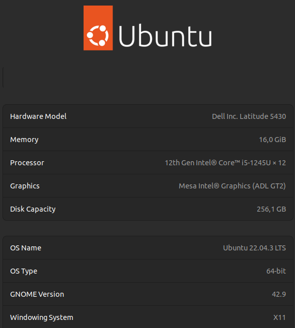

# LINUX - Basico ao Avançado

## Tecnlogias utilizadas


### Commands

```
Atualizações
    sudo apt update
    sudo apt upgrade

Pesquisar Arquivos
    sudo find / -name nome_arquivo


```



## Desenvolvedor
<a href="https://www.linkedin.com/in/guilherme-urbinatti-26716133/">
    
</a>

